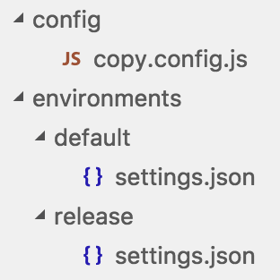

# ionic-configuration-service

**The dependencies used by the latest version are the same as needed for [Ionic 2.0.0](https://github.com/driftyco/ionic/blob/master/CHANGELOG.md).**

[](https://travis-ci.org/Ritzlgrmft/ionic-configuration-service)
[](https://codecov.io/gh/Ritzlgrmft/ionic-configuration-service)
[](https://www.npmjs.com/package/ionic-configuration-service)
[](https://www.npmjs.com/package/ionic-configuration-service)
[](https://david-dm.org/ritzlgrmft/ionic-configuration-service/master)
[](https://david-dm.org/ritzlgrmft/ionic-configuration-service/master?type=peer)
[](https://david-dm.org/ritzlgrmft/ionic-configuration-service/master?type=dev)
[](http://commitizen.github.io/cz-cli/)
[](https://www.npmjs.com/package/ionic-configuration-service)

This service encapsulates configuration functionalities for apps built with [Ionic framework](http://ionicframework.com).

Most apps need some kind of configuration. And often, the configuration data is different
between the environments:

- maybe you want to use different web services in test and production
- in test, you want to log everything, but in prodiction only errors
- you want to have all configuration data in one place, so you are able to change something easily
- ...

The idea is:

- add *one* json file containing all the configuration data
- at *build* this file can be modified (par example you will use a different file in your release build)
- before the app really starts, the configuration gets loaded
- whereever you need the configuration data, you can get it via the injected configuration service

## Settings file containing the configuration data

The settings file is just a JSON file. It contains some keys, whose values can be of any type (either scalar or complex):

```json
{
  "helloWorld": "Hello World",
  "secretNumber": 42,
  "somethingComplex": {
    "backendUrl": "http://server.com/api"
  }
}
```

## Replace settings file at build time

Now it gets a little bit tricky: you have a json file in a source directory (e.g. `environments`),
which should be copied to the `www/assets` directory. A good place to do this is using the copy step of Ionic's build.
You just need to add a copy statement to `copy.config.js`.

Unfortunately, the copied file should have always the same name. Otherwise you could not load it in your code.
On the other side, you want to have several files (with different names) for the different environments.
The solution is to have separate directories for every environment.

### Folder structure

So, in the source, you have the following folder structure:



Just create a new folder below `environments` for every environment you want to support. Be aware that the filename itself
(`settings.json`) has to be always the same.

### Copy correct environment

If you do not have an own `copy.config.js`, just create one. For details have a look at
[Custom configuration of Ionic's app scripts](https://github.com/driftyco/ionic-app-scripts#custom-configuration).

There you can add your own copy step to `module.exports`:

```JavaScript
module.exports = {
  copySettings: {
    src: ['{{ROOT}}/environments/' + envDirectory + "/settings.json"],
    dest: '{{WWW}}/assets'
  },
  ...
}
```

As you can see, it simply copies the `settings.json` from `envDirectory` to `www/assets`.
What is missing so far, is the right value of `envDirectory`, which has to be dynamic.
Fortunately, `copy.config.js` is just JavaScript. So we can add some logic at the beginning:

```JavaScript
var envDirectory = "default";
var envIndex = process.argv.indexOf("--env");
if (envIndex >= 0 && envIndex < process.argv.length - 1) {
  envDirectory = process.argv[envIndex + 1];
}
```

As you see, `envDirectory` has a default value of `default`.
But if you call the build command with the `--env` argument, you can set there another environment.
If you want to test the release environment in the emulator, you can use:

```bash
ionic emulate --prod --env release
```

## Load the configuration data

The loading of the configuration data is done in the `AppModule`, before the bootstrapping
of the `IonicApp`. This is done using [Angular's APP_INITIALIZER](https://github.com/angular/angular/issues/9047):

```TypeScript
import { APP_INITIALIZER } from "@angular/core";
import { ConfigurationService } from "ionic-configuration-service";

@NgModule({
  ...
  providers: [
    ConfigurationService,
    {
      provide: APP_INITIALIZER,
      useFactory: (configurationService: ConfigurationService) => () => configurationService.load("assets/settings.json"),
      deps: [ConfigurationService],
      multi: true
    },
    ....
  ]
})
```

For `APP_INITIALIZER`, the factory function just loads the configuration data.
The `multi` parameter is important, because there can be more `APP_INITIALIZER`s.

## Access the configuration data

The access to the configuration data is quite easy. Just inject the `ConfigurationService` into your component.
And call `configurationService.getValue()` later on:

```TypeScript
constructor(
  private configurationService: ConfigurationService) {
}

let secretNumber = this.configurationService.getValue<number>("secretNumber");
```

For more complex configuration, it's a good practise to define an interface
describing your part of the configuration:

```TypeScript
export interface LoggingConfiguration {
  logLevels?: {
    loggerName: string;
    logLevel: string;
   }[];
}

let configuration = this.configurationService.getValue<LoggingConfiguration>("logging");
```

## API

### getKeys(): string[]

Get all available keys.

Returns

- all available keys

### getValue&lt;T>(key: string): T

Get the configuration data for the given key.

Parameters

- *T*: type of the returned value (default: object)
- *key*: key of the configuration data

Returns

- configuration data for the given key

### load(configurationUrl: string): Promise&lt;void>

Loads the configuration from the given url.

Parameters

- *configurationUrl* url from which the configuration should be loaded

Returns

- promise which gets resolved as soon as the data is loaded;
  in case of an error, the promise gets rejected
